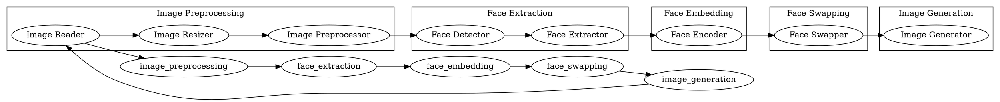

```dot
digraph deepfacelab {
    graph [rankdir=LR];

    // Subgraph for image preprocessing
    subgraph cluster_image_preprocessing {
        label="Image Preprocessing";

        image_reader [label="Image Reader"];
        image_resizer [label="Image Resizer"];
        image_preprocessor [label="Image Preprocessor"];

        image_reader -> image_resizer;
        image_resizer -> image_preprocessor;
    }

    // Subgraph for face extraction
    subgraph cluster_face_extraction {
        label="Face Extraction";

        face_detector [label="Face Detector"];
        face_extractor [label="Face Extractor"];

        image_preprocessor -> face_detector;
        face_detector -> face_extractor;
    }

    // Subgraph for face embedding
    subgraph cluster_face_embedding {
        label="Face Embedding";

        face_encoder [label="Face Encoder"];

        face_extractor -> face_encoder;
    }

    // Subgraph for face swapping
    subgraph cluster_face_swapping {
        label="Face Swapping";

        face_swapper [label="Face Swapper"];

        face_encoder -> face_swapper;
    }

    // Subgraph for image generation
    subgraph cluster_image_generation {
        label="Image Generation";

        image_generator [label="Image Generator"];

        face_swapper -> image_generator;
    }

    // Main flow
    image_reader -> image_preprocessing;
    image_preprocessing -> face_extraction;
    face_extraction -> face_embedding;
    face_embedding -> face_swapping;
    face_swapping -> image_generation;
    image_generation -> image_reader;
}
```